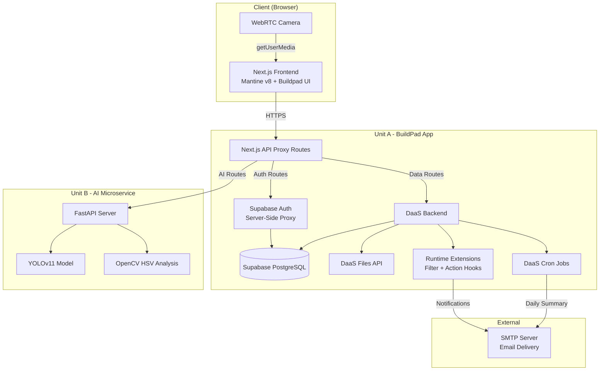
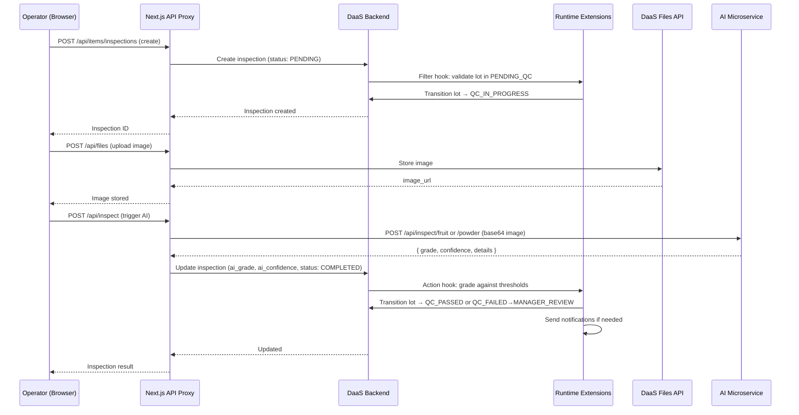
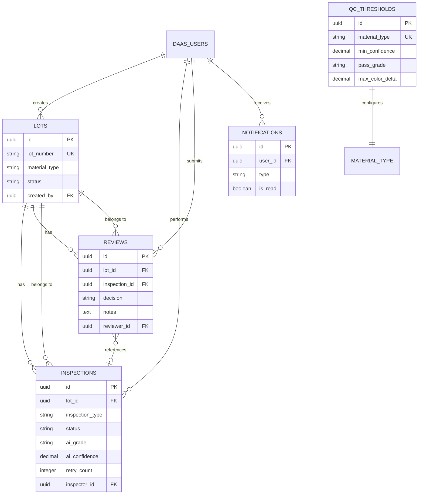
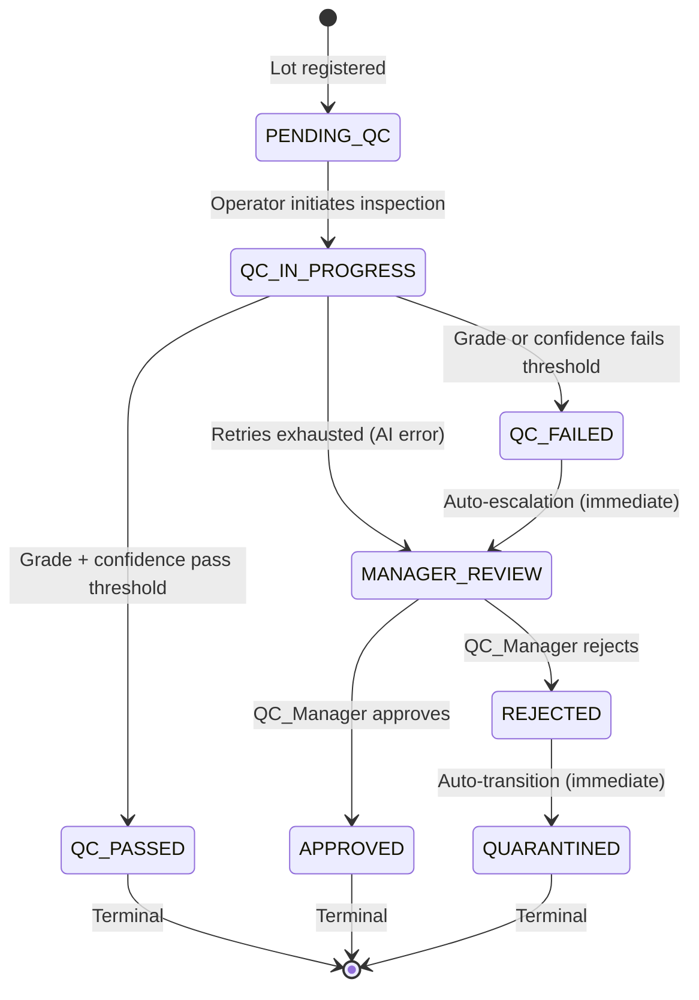
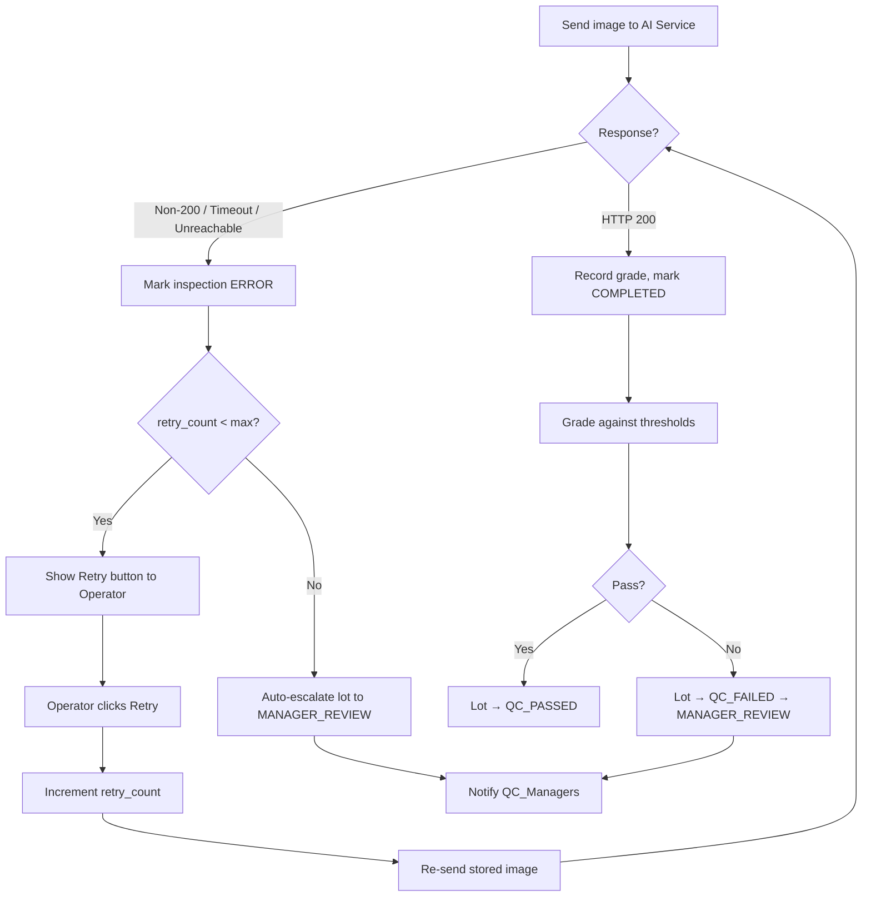

# Design Document: AromAI QC Platform

## Overview

The AromAI QC Platform is a dual-unit AI-powered quality control system for Sima Arome. It consists of:

- **Unit A (Platform)**: A BuildPad App (Next.js + DaaS backend + Supabase Auth) handling UI, data model, RBAC, workflow orchestration, notifications, file storage, and API gateway
- **Unit B (AI Microservice)**: A FastAPI service (deployed on Railway/Render) performing YOLOv11 defect detection and OpenCV HSV color analysis

The platform enables operators to register material lots, capture inspection images via WebRTC camera, submit them to the AI service for automated grading, and routes flagged lots through a manager review workflow. A strict state machine governs lot lifecycle, with role-based access control, audit logging, configurable thresholds, and retry mechanisms for AI service failures.

### Key Design Decisions

1. **DaaS-native state machine**: Lot status transitions are enforced via DaaS Runtime Extensions (filter hooks) rather than custom middleware, ensuring server-side enforcement regardless of client.
2. **Proxy-first AI integration**: All AI service calls route through Next.js API proxy routes, keeping the AI service URL and credentials server-side only.
3. **Buildpad UI components**: All forms, lists, and filters use Buildpad components (CollectionList, VForm, CollectionForm, etc.) installed via CLI.
4. **DaaS built-in audit logging**: Leverages `daas_activity` table for all mutation tracking — no custom audit tables.
5. **DaaS Cron for scheduled tasks**: Daily summary emails use DaaS Cron Jobs, not external schedulers.
6. **WebRTC with manual fallback**: Camera auto-capture is the primary flow; manual file upload is always available as fallback.

## Architecture

### System Architecture Diagram



### Data Flow: Inspection Lifecycle



### Component Architecture

```mermaid
graph LR
    subgraph "Next.js App Router Pages"
        LOGIN[/login]
        DASH[/dashboard]
        LOTS[/lots]
        LOTD[/lots/[id]]
        INSP[/lots/[id]/inspect]
        REV[/review]
        USERS[/admin/users]
        CONFIG[/admin/config]
        THRESH[/admin/thresholds]
        REPORT[/reports]
    end

    subgraph "API Proxy Routes"
        AUTH_R[/api/auth/*]
        ITEMS_R[/api/items/*]
        FILES_R[/api/files/*]
        AI_R[/api/inspect/*]
        EXPORT_R[/api/export/*]
        NOTIF_R[/api/notifications/*]
    end

    subgraph "DaaS Collections"
        C_LOTS[lots]
        C_INSP[inspections]
        C_REV[reviews]
        C_THRESH[qc_thresholds]
        C_NOTIF[notifications]
        C_CONFIG[system_config]
    end
```

## Components and Interfaces

### Next.js API Proxy Routes

| Route | Method | Purpose | Auth Required |
|-------|--------|---------|---------------|
| `/api/auth/login` | POST | Authenticate user via Supabase | No |
| `/api/auth/logout` | POST | End session | Yes |
| `/api/auth/session` | GET | Get current session | Yes |
| `/api/items/lots` | GET/POST | List/create lots | Yes (OPERATOR+) |
| `/api/items/lots/[id]` | GET/PATCH | Get/update lot | Yes (role-scoped) |
| `/api/items/inspections` | GET/POST | List/create inspections | Yes (OPERATOR+) |
| `/api/items/inspections/[id]` | GET/PATCH | Get/update inspection | Yes (role-scoped) |
| `/api/items/reviews` | GET/POST | List/create reviews | Yes (QC_MANAGER+) |
| `/api/items/qc_thresholds` | GET/PATCH | List/update thresholds | Yes (ADMIN) |
| `/api/items/notifications` | GET/PATCH | List/mark-read notifications | Yes |
| `/api/items/system_config` | GET/PATCH | Get/update config | Yes (ADMIN) |
| `/api/files` | POST | Upload inspection image | Yes (OPERATOR+) |
| `/api/inspect/fruit` | POST | Proxy to AI fruit inspection | Yes (OPERATOR+) |
| `/api/inspect/powder` | POST | Proxy to AI powder inspection | Yes (OPERATOR+) |
| `/api/inspect/health` | GET | Check AI service health | Yes (ADMIN) |
| `/api/export/inspections` | GET | CSV export of inspections | Yes (QC_MANAGER+) |
| `/api/notifications/unread-count` | GET | Get unread notification count | Yes |

### AI Microservice API (Unit B)

| Endpoint | Method | Request | Response |
|----------|--------|---------|----------|
| `/api/inspect/fruit` | POST | `{ image_base64, material_type }` | `{ grade, confidence, defects_found, annotated_image_base64, details }` |
| `/api/inspect/powder` | POST | `{ image_base64, material_name }` | `{ grade, confidence, color_score, color_analysis, annotated_image_base64, details }` |
| `/api/health` | GET | — | `{ status: "healthy", model_loaded: true, version }` |
| `/docs` | GET | — | Swagger/OpenAPI documentation |

### Runtime Extensions (DaaS Hooks)

| Extension | Type | Event | Purpose |
|-----------|------|-------|---------|
| `lot-number-generator` | Filter | `lots.items.create` | Auto-generate LOT-YYYYMMDD-XXXX |
| `lot-state-machine` | Filter | `lots.items.update` | Enforce valid state transitions |
| `inspection-grading` | Action | `inspections.items.update` | Grade against thresholds on COMPLETED |
| `notification-dispatcher` | Action | `lots.items.update` | Send notifications on status changes |
| `review-validator` | Filter | `reviews.items.create` | Validate lot is in MANAGER_REVIEW |
| `config-audit` | Action | `system_config.items.update` | Log config changes with prev/new values |

### DaaS Cron Jobs

| Job | Schedule | Purpose |
|-----|----------|---------|
| `daily-summary-email` | `59 23 * * *` | Send daily inspection summary to QC_Managers |
| `ai-health-check` | `* * * * *` | Check AI service availability every 60s |

### UI Components (Buildpad)

| Page | Buildpad Components Used |
|------|--------------------------|
| Lot Registration | `VForm`, `Input`, `SelectDropdown`, `CollectionForm` |
| Lot List | `CollectionList`, `FilterPanel` |
| Inspection Camera | Custom WebRTC component + `Upload` (fallback) |
| Inspection Results | `CollectionList`, `FilterPanel` |
| Manager Review Queue | `CollectionList`, `FilterPanel` |
| Review Form | `VForm`, `Textarea` |
| Dashboard | Custom charts (Mantine `Paper`, `Text`, `Badge`) |
| User Management | `CollectionList`, `CollectionForm`, `SelectDropdown` |
| QC Thresholds | `CollectionForm`, `Input`, `SelectDropdown` |
| System Config | `CollectionForm`, `Input` |
| Notifications | Custom dropdown (Mantine `Menu`, `Badge`) |

**Buildpad CLI install command** (new project bootstrap):
```bash
npx @buildpad/cli@latest bootstrap --cwd d:\aromai-qualsense-starter
```

## Data Models

### DaaS Collections Schema

#### `lots` Collection

| Field | Type | Constraints | Description |
|-------|------|-------------|-------------|
| `id` | uuid | PK, auto | Primary key |
| `lot_number` | string | unique, max 20 | Format: LOT-YYYYMMDD-XXXX |
| `material_type` | string | enum: RAW_FRUIT, RAW_BOTANICAL, EXTRACT_POWDER | Material classification |
| `material_name` | string | max 200, required | Name of the material |
| `supplier_name` | string | max 200, required | Supplier identifier |
| `quantity_kg` | decimal | > 0.01, <= 999999.99, 2 decimal places | Batch quantity |
| `status` | string | enum: PENDING_QC, QC_IN_PROGRESS, QC_PASSED, QC_FAILED, MANAGER_REVIEW, APPROVED, REJECTED, QUARANTINED | Current lifecycle state |
| `status_changed_at` | timestamp | auto-updated | UTC ISO 8601 timestamp of last transition |
| `created_by` | uuid | FK → daas_users.id | Operator who registered the lot |
| `user_created` | uuid | auto (DaaS) | DaaS audit: creator |
| `user_updated` | uuid | auto (DaaS) | DaaS audit: last updater |
| `date_created` | timestamp | auto (DaaS) | DaaS audit: creation time |
| `date_updated` | timestamp | auto (DaaS) | DaaS audit: last update time |

#### `inspections` Collection

| Field | Type | Constraints | Description |
|-------|------|-------------|-------------|
| `id` | uuid | PK, auto | Primary key |
| `lot_id` | uuid | FK → lots.id, required | Associated lot |
| `inspection_type` | string | enum: RAW_MATERIAL, POWDER | Derived from lot material_type |
| `status` | string | enum: PENDING, COMPLETED, ERROR | Inspection processing state |
| `image_url` | string | nullable | DaaS Files API URL of captured image |
| `annotated_image_url` | string | nullable | AI-annotated image URL |
| `ai_grade` | string | enum: A, B, C, D, F, nullable | AI-assigned quality grade |
| `ai_confidence` | decimal | 0.0–1.0, nullable | AI confidence score |
| `ai_details` | json | nullable | Full AI response payload or error info |
| `defects_found` | json | nullable | Defect list (fruit inspections) |
| `color_score` | decimal | nullable | Color delta (powder inspections) |
| `retry_count` | integer | default 0, max from config | Number of retry attempts |
| `inspector_id` | uuid | FK → daas_users.id | Operator who performed inspection |
| `user_created` | uuid | auto (DaaS) | DaaS audit |
| `date_created` | timestamp | auto (DaaS) | DaaS audit |
| `date_updated` | timestamp | auto (DaaS) | DaaS audit |

#### `reviews` Collection

| Field | Type | Constraints | Description |
|-------|------|-------------|-------------|
| `id` | uuid | PK, auto | Primary key |
| `lot_id` | uuid | FK → lots.id, required | Reviewed lot |
| `inspection_id` | uuid | FK → inspections.id, nullable | Related inspection |
| `decision` | string | enum: APPROVED, REJECTED, required | Manager decision |
| `notes` | text | 10–1000 chars, required | Review justification |
| `reviewer_id` | uuid | FK → daas_users.id | QC Manager who reviewed |
| `user_created` | uuid | auto (DaaS) | DaaS audit |
| `date_created` | timestamp | auto (DaaS) | DaaS audit |

#### `qc_thresholds` Collection

| Field | Type | Constraints | Description |
|-------|------|-------------|-------------|
| `id` | uuid | PK, auto | Primary key |
| `material_type` | string | unique, enum: RAW_FRUIT, RAW_BOTANICAL, EXTRACT_POWDER | One row per type |
| `min_confidence` | decimal | 0.0–1.0, required | Minimum AI confidence to pass |
| `pass_grade` | string | enum: A, B, C, D, F, required | Minimum grade to pass |
| `max_color_delta` | decimal | 0.1–100.0, required | Max color deviation (powder only) |
| `user_updated` | uuid | auto (DaaS) | DaaS audit |
| `date_updated` | timestamp | auto (DaaS) | DaaS audit |

#### `notifications` Collection

| Field | Type | Constraints | Description |
|-------|------|-------------|-------------|
| `id` | uuid | PK, auto | Primary key |
| `user_id` | uuid | FK → daas_users.id, required | Recipient |
| `type` | string | enum: LOT_FAILED, LOT_APPROVED, LOT_REJECTED, LOT_QUARANTINED, LOT_ESCALATED, AI_ERROR, CRON_ERROR | Notification category |
| `title` | string | max 200, required | Short notification title |
| `message` | text | required | Notification body |
| `is_read` | boolean | default false | Read status |
| `reference_type` | string | nullable | Entity type (e.g., "lots") |
| `reference_id` | uuid | nullable | Entity ID for navigation |
| `user_created` | uuid | auto (DaaS) | DaaS audit |
| `date_created` | timestamp | auto (DaaS) | DaaS audit |

#### `system_config` Collection (Singleton)

| Field | Type | Constraints | Description |
|-------|------|-------------|-------------|
| `id` | uuid | PK, auto | Primary key |
| `max_retry_count` | integer | 1–10, default 3 | Max inspection retries |
| `ai_timeout_seconds` | decimal | 1.0–30.0, default 5.0 | AI service response timeout |
| `ai_health_check_interval` | integer | 30–300, default 60 | Health check interval (seconds) |
| `ai_service_url` | string | required | AI microservice base URL |
| `ai_service_status` | string | enum: HEALTHY, UNHEALTHY | Last known AI service status |
| `ai_last_health_check` | timestamp | nullable | Last successful health check |
| `user_updated` | uuid | auto (DaaS) | DaaS audit |
| `date_updated` | timestamp | auto (DaaS) | DaaS audit |

### Entity Relationships



### Lot Lifecycle State Machine



**Valid Transitions Map** (enforced by `lot-state-machine` filter hook):

```typescript
const VALID_TRANSITIONS: Record<string, string[]> = {
  'PENDING_QC': ['QC_IN_PROGRESS'],
  'QC_IN_PROGRESS': ['QC_PASSED', 'QC_FAILED', 'MANAGER_REVIEW'],
  'QC_FAILED': ['MANAGER_REVIEW'],
  'MANAGER_REVIEW': ['APPROVED', 'REJECTED'],
  'REJECTED': ['QUARANTINED'],
  // Terminal states — no outgoing transitions
  'QC_PASSED': [],
  'APPROVED': [],
  'QUARANTINED': [],
};
```

### RBAC Design (DaaS Permissions System)

#### Roles

| Role | DaaS Role Name | Hierarchy |
|------|---------------|-----------|
| Operator | `operator` | Base level |
| QC Manager | `qc_manager` | Includes all Operator permissions |
| Admin | `admin` | Includes all QC Manager permissions |

#### Policies and Permissions

**Operator Policy** (`operator-policy`):
- `lots`: create (all fields), read (own: `created_by = $CURRENT_USER`), update (none — status changes are system-driven)
- `inspections`: create, read (own: `inspector_id = $CURRENT_USER`), update (retry only: `inspector_id = $CURRENT_USER`)
- `notifications`: read (own: `user_id = $CURRENT_USER`), update (mark read: `user_id = $CURRENT_USER`)
- `qc_thresholds`: read
- `system_config`: read (limited fields: `max_retry_count`, `ai_service_status`)

**QC Manager Policy** (`qc-manager-policy`):
- `lots`: read (all), update (none directly)
- `inspections`: read (all)
- `reviews`: create, read (all)
- `notifications`: read (own), update (mark read)
- `qc_thresholds`: read
- `system_config`: read

**Admin Policy** (`admin-policy`):
- All collections: full CRUD
- `daas_users`: read, update (role assignment, activation)
- `system_config`: read, update
- `qc_thresholds`: read, update
- Activity log access via `GET /api/activity`

#### Access Hierarchy Implementation

```
Admin Role
  └── admin-policy (admin_access: true)

QC Manager Role
  ├── qc-manager-policy (app_access: true)
  └── operator-policy (inherited)

Operator Role
  └── operator-policy (app_access: true)
```

### Notification System Design

#### In-App Notifications

Notifications are stored in the `notifications` DaaS collection. The frontend polls for unread count via `/api/notifications/unread-count` every 30 seconds and displays a badge in the header.

#### Email Notifications

Emails are sent via DaaS SMTP settings (configured via `mcp_daas_smtp_settings`). The `notification-dispatcher` action hook triggers email sending for events that require it:

| Event | In-App | Email | Recipients |
|-------|--------|-------|------------|
| Lot → QC_FAILED | ✓ | ✓ | All active QC_Managers |
| Lot → APPROVED/REJECTED | ✓ | — | Lot creator (Operator) |
| Lot → QUARANTINED | ✓ | ✓ | All active Admins |
| Lot → MANAGER_REVIEW (retries exhausted) | ✓ | ✓ | All active QC_Managers |
| AI Service error (3 consecutive failures) | ✓ | ✓ | All active Admins |
| Daily summary | — | ✓ | All active QC_Managers |
| Cron job failure | ✓ | ✓ | All active Admins |

#### Throttling

AI service error notifications are throttled to max 1 per 15-minute window per failure type, tracked via a `last_ai_error_notification` timestamp in `system_config`.

### Cron Job Design

#### Daily Summary Email (`daily-summary-email`)

```javascript
// Scheduled: 59 23 * * * (23:59 daily)
const inspections = await services.items('inspections');
const today = new Date().toISOString().slice(0, 10);

const results = await inspections.readByQuery({
  filter: { date_created: { _gte: `${today}T00:00:00`, _lte: `${today}T23:59:59` } },
  aggregate: { count: ['id'] },
  groupBy: ['status']
});

// Calculate totals and send email to all active QC_Managers
```

#### AI Health Check (`ai-health-check`)

```javascript
// Scheduled: * * * * * (every minute)
// Uses services.fetch to call AI_Service /api/health
// Updates system_config.ai_service_status
// Sends notification if 3 consecutive failures
```

### Error Handling and Retry Logic

#### AI Service Error Flow



#### Error Categories and Handling

| Error Type | HTTP Status | Handling |
|------------|-------------|----------|
| AI timeout | — | Record timeout reason, mark ERROR, allow retry |
| AI unreachable | — | Record connection error, mark ERROR, allow retry |
| AI 4xx | 400-499 | Record status + body, mark ERROR, allow retry |
| AI 5xx | 500-599 | Record status + body, mark ERROR, allow retry |
| Image storage failure | — | Display error, keep PENDING, allow re-capture |
| Invalid image | — | Reject before upload, show validation errors |
| State machine violation | — | Reject transition, return error with current/target status |
| Concurrent state change | — | Reject with "status has changed" error |

#### Concurrency Control

Lot state transitions use optimistic concurrency via a `status` field check in the DaaS filter hook:
1. Read current lot status
2. Validate transition is allowed
3. Apply update with filter `{ id: lot_id, status: expected_current_status }`
4. If 0 rows affected → concurrent modification detected → reject

## Correctness Properties

*A property is a characteristic or behavior that should hold true across all valid executions of a system — essentially, a formal statement about what the system should do. Properties serve as the bridge between human-readable specifications and machine-verifiable correctness guarantees.*

### Property 1: Lot creation produces valid initial state

*For any* valid lot registration payload (valid material_type, material_name 1-200 chars, supplier_name 1-200 chars, quantity_kg > 0.01 and <= 999999.99 with max 2 decimal places), the created lot SHALL have status `PENDING_QC`, a `lot_number` matching the regex `LOT-\d{8}-\d{4}`, and `created_by` equal to the authenticated operator's user ID.

**Validates: Requirements 1.1, 1.2**

### Property 2: Lot registration validation rejects invalid inputs

*For any* lot registration payload where material_type is not in {RAW_FRUIT, RAW_BOTANICAL, EXTRACT_POWDER}, OR material_name is empty or exceeds 200 characters, OR supplier_name is empty or exceeds 200 characters, OR quantity_kg is <= 0.01 or > 999999.99 or has more than 2 decimal places, the system SHALL reject the registration without creating a lot record.

**Validates: Requirements 1.3, 1.4, 1.5**

### Property 3: Lot_Number sequential uniqueness within a day

*For any* sequence of N lot registrations on the same calendar day (where N <= 9999), the generated lot_numbers SHALL all share the same date portion (YYYYMMDD matching the current date), have strictly increasing counter portions (XXXX), and no two lot_numbers SHALL be equal.

**Validates: Requirements 1.2, 1.6**

### Property 4: Inspection creation transitions lot correctly

*For any* lot in PENDING_QC status, creating an inspection SHALL transition the lot to QC_IN_PROGRESS and produce an inspection record with status PENDING, the correct inspection_type (RAW_MATERIAL for RAW_FRUIT/RAW_BOTANICAL, POWDER for EXTRACT_POWDER), and inspector_id matching the authenticated operator.

**Validates: Requirements 2.1, 2.8**

### Property 5: Image validation accepts only valid images

*For any* file, the image validation function SHALL accept it if and only if: the file header bytes match JPEG (FF D8 FF), PNG (89 50 4E 47), or WebP (52 49 46 46...57 45 42 50) signatures, AND file size <= 10 MB, AND dimensions >= 640x480, AND dimensions <= 4096x3072. All violated constraints SHALL be reported together.

**Validates: Requirements 3.1, 3.2, 3.3, 3.4, 3.5**

### Property 6: AI endpoint routing correctness

*For any* inspection, the system SHALL route to POST /api/inspect/fruit when inspection_type is RAW_MATERIAL, and to POST /api/inspect/powder when inspection_type is POWDER, with the image encoded as base64 and the appropriate metadata (material_type for fruit, material_name for powder).

**Validates: Requirements 4.1, 4.2**

### Property 7: Successful AI response recording

*For any* valid AI response (HTTP 200 with grade in {A,B,C,D,F} and confidence in [0.0, 1.0]), the inspection SHALL be updated with ai_grade, ai_confidence, ai_details, and status transitioned to COMPLETED.

**Validates: Requirements 4.3**

### Property 8: AI error handling preserves retry capability

*For any* AI service error (non-200, timeout, or unreachable) when the inspection's retry_count is below the configured maximum, the inspection SHALL transition to ERROR, the error details SHALL be recorded in ai_details, and the lot SHALL remain in QC_IN_PROGRESS status.

**Validates: Requirements 4.4, 4.5, 5.5**

### Property 9: Retry mechanism correctness

*For any* inspection in ERROR status with retry_count < configured maximum, executing a retry SHALL increment retry_count by exactly 1, transition inspection status to PENDING, and re-send the stored image to the correct AI endpoint based on inspection_type.

**Validates: Requirements 5.2, 5.3**

### Property 10: Max retries exhausted triggers escalation

*For any* inspection where retry_count equals the configured maximum and the AI service returns an error, the system SHALL transition the lot to MANAGER_REVIEW status and the inspection SHALL remain in ERROR status with the retry button disabled.

**Validates: Requirements 5.4**

### Property 11: Grading logic correctness

*For any* completed inspection with ai_grade G, ai_confidence C, and color_score CS (for EXTRACT_POWDER), and a QC_Threshold with pass_grade PG, min_confidence MC, and max_color_delta MCD: the lot SHALL transition to QC_PASSED if and only if G >= PG (using ordering A > B > C > D > F) AND C >= MC AND (for EXTRACT_POWDER: CS <= MCD). Otherwise, the lot SHALL transition to QC_FAILED.

**Validates: Requirements 6.2, 6.3**

### Property 12: QC_FAILED immediately auto-escalates to MANAGER_REVIEW

*For any* lot transitioning to QC_FAILED, the system SHALL within the same operation transition the lot to MANAGER_REVIEW status.

**Validates: Requirements 6.4**

### Property 13: Review decision state transitions

*For any* lot in MANAGER_REVIEW status, approving with notes (10-1000 chars) SHALL create a review record with decision APPROVED and transition the lot to APPROVED; rejecting with notes (10-1000 chars) SHALL create a review record with decision REJECTED and transition the lot to REJECTED, which SHALL immediately auto-transition to QUARANTINED.

**Validates: Requirements 7.2, 7.3, 7.4**

### Property 14: Review rejection for non-MANAGER_REVIEW lots

*For any* lot NOT in MANAGER_REVIEW status, attempting to create a review (approve or reject) SHALL be rejected with an error, and the lot status SHALL remain unchanged.

**Validates: Requirements 7.7**

### Property 15: State machine transition enforcement

*For any* (current_status, target_status) pair, the system SHALL allow the transition if and only if target_status is in the valid transitions map for current_status. Invalid transitions SHALL be rejected, preserving the lot's current status and all field values unchanged.

**Validates: Requirements 8.1, 8.2, 8.5**

### Property 16: State transition timestamp recording

*For any* valid state transition, the lot's status_changed_at field SHALL be updated to a valid UTC ISO 8601 timestamp that is greater than or equal to the previous status_changed_at value.

**Validates: Requirements 8.3**

### Property 17: Operator data scoping

*For any* operator user, querying lots or inspections SHALL return only records where created_by (for lots) or inspector_id (for inspections) equals the operator's user_id. Records created by other operators SHALL never be visible.

**Validates: Requirements 9.2, 15.5**

### Property 18: Role-based action enforcement

*For any* user with role OPERATOR attempting QC_Manager-only actions (create review, view all lots, export reports) or Admin-only actions (user management, config updates, threshold updates), the system SHALL deny the request with an authorization error that does not reveal resource existence.

**Validates: Requirements 9.4, 9.5**

### Property 19: QC_Threshold validation

*For any* threshold update, the system SHALL accept it if and only if min_confidence is in [0.0, 1.0], pass_grade is in {A, B, C, D, F}, and max_color_delta is in [0.1, 100.0]. Invalid values SHALL be rejected with field-specific error messages.

**Validates: Requirements 11.2, 11.3**

### Property 20: Updated thresholds apply only to future gradings

*For any* QC_Threshold update at time T, inspections whose grading step occurred before T SHALL retain their original pass/fail outcome, while inspections graded after T SHALL use the new threshold values.

**Validates: Requirements 11.5**

### Property 21: Operator dashboard scoped metrics

*For any* operator, dashboard metrics (total lots by status, pass/fail rates, average confidence) SHALL be calculated exclusively from lots where created_by equals the operator's user_id.

**Validates: Requirements 12.2**

### Property 22: Daily summary calculation correctness

*For any* set of inspections created on a given day, the daily summary SHALL correctly calculate total_inspected as the count of all inspections, total_passed as the count with lot status QC_PASSED or APPROVED, total_failed as the count with lot status QC_FAILED or QUARANTINED, and total_pending_review as the count with lot status MANAGER_REVIEW.

**Validates: Requirements 14.2**

### Property 23: CSV export field completeness

*For any* set of filtered inspections, the CSV export SHALL contain exactly the fields: lot_number, material_type, material_name, inspection_date, inspector_name, grade, confidence_score, status, defects_found_count, and review_decision, with values matching the source data.

**Validates: Requirements 15.3**

### Property 24: User validation correctness

*For any* user creation or update payload, the system SHALL accept it if and only if email is valid format (max 254 chars), name is 1-100 chars, and role is in {OPERATOR, QC_MANAGER, ADMIN}. Email uniqueness SHALL be enforced case-insensitively.

**Validates: Requirements 16.1, 16.2, 16.4**

### Property 25: Admin self-modification prevention

*For any* admin user, attempting to deactivate their own account or change their own role to a non-ADMIN role SHALL be rejected.

**Validates: Requirements 16.6**

### Property 26: Role-appropriate login redirect

*For any* authenticated user, successful login SHALL redirect to: lot overview for OPERATOR, review queue dashboard for QC_MANAGER, and system dashboard for ADMIN.

**Validates: Requirements 17.2**

### Property 27: Account lockout after failed attempts

*For any* user account, 5 consecutive failed authentication attempts within a 15-minute window SHALL temporarily lock the account for 15 minutes. Fewer than 5 failures, or failures spread across more than 15 minutes, SHALL NOT trigger lockout.

**Validates: Requirements 17.7**

### Property 28: System configuration validation

*For any* system configuration update, max_retry_count SHALL be accepted if and only if it is a positive integer in [1, 10], and ai_timeout_seconds SHALL be accepted if and only if it is a positive decimal in [1.0, 30.0].

**Validates: Requirements 19.2, 19.3**

### Property 29: Notification read/unread state management

*For any* notification, it SHALL default to is_read=false upon creation, and marking it as read SHALL set is_read=true. The unread count for a user SHALL equal the number of their notifications where is_read=false.

**Validates: Requirements 13.7**

### Property 30: Date range filter bounds

*For any* dashboard date range filter, the system SHALL accept ranges between 1 and 365 days inclusive, and SHALL reject ranges outside these bounds.

**Validates: Requirements 12.5**

## Error Handling

### Error Response Format

All API errors follow a consistent structure:

```typescript
interface ApiError {
  status: number;
  code: string;
  message: string;
  errors?: Array<{
    field: string;
    constraint: string;
    message: string;
  }>;
}
```

### Error Categories

| Category | HTTP Status | Code Pattern | Example |
|----------|-------------|--------------|---------|
| Validation | 400 | `VALIDATION_ERROR` | Invalid quantity_kg format |
| Authentication | 401 | `UNAUTHORIZED` | Expired session |
| Authorization | 403 | `FORBIDDEN` | Operator accessing admin route |
| Not Found | 404 | `NOT_FOUND` | Lot ID doesn't exist |
| Conflict | 409 | `CONFLICT` | Duplicate lot_number, concurrent state change |
| Rate Limit | 429 | `RATE_LIMITED` | Account locked after 5 failed logins |
| AI Service | 502 | `AI_SERVICE_ERROR` | AI service unreachable |
| AI Timeout | 504 | `AI_SERVICE_TIMEOUT` | AI response exceeded timeout |
| Internal | 500 | `INTERNAL_ERROR` | Unexpected server error |

### Retry Strategy

| Operation | Max Retries | Backoff | Trigger |
|-----------|-------------|---------|---------|
| AI inspection | Configurable (1-10, default 3) | Manual (operator-initiated) | AI error/timeout |
| File upload | 0 (manual re-capture) | — | Storage failure |
| State transition | 0 (reject with error) | — | Concurrent modification |

### Circuit Breaker (AI Health Check)

The AI health check cron job implements a simple circuit breaker:
- **Closed** (HEALTHY): Normal operation, health checks every 60s
- **Open** (UNHEALTHY): After 3 consecutive health check failures, mark as UNHEALTHY, notify admins
- **Half-Open**: On next successful health check, transition back to HEALTHY

Throttling: Max 1 AI error notification per 15-minute window to prevent flooding.

## Testing Strategy

### Dual Testing Approach

This feature uses both unit tests and property-based tests for comprehensive coverage:

**Property-Based Tests** (using [fast-check](https://github.com/dubzzz/fast-check) for TypeScript):
- Minimum 100 iterations per property test
- Each test references its design document property number
- Tag format: `Feature: aromai-qc-platform, Property {N}: {title}`
- Focus on: validation logic, state machine transitions, grading logic, data scoping, format generation

**Unit Tests** (using Vitest):
- Specific examples and edge cases
- Integration points between components
- Error handling scenarios
- Notification trigger verification

**E2E Tests** (using Playwright):
- Camera capture flow (with mocked getUserMedia)
- Full inspection lifecycle
- Manager review workflow
- Dashboard rendering
- Role-based navigation

### Test Configuration

```typescript
// vitest.config.ts
import { defineConfig } from 'vitest/config';

export default defineConfig({
  test: {
    globals: true,
    environment: 'node',
    include: ['**/*.{test,spec}.{ts,tsx}'],
    coverage: {
      provider: 'v8',
      reporter: ['text', 'html'],
      exclude: ['node_modules/', '.next/'],
    },
  },
});
```

### Property Test Structure

```typescript
import { fc } from '@fast-check/vitest';
import { describe, it } from 'vitest';

describe('Feature: aromai-qc-platform', () => {
  // Property 15: State machine transition enforcement
  it.prop(
    [fc.constantFrom(...ALL_STATUSES), fc.constantFrom(...ALL_STATUSES)],
    { numRuns: 100 }
  )('Property 15: For any (current, target) pair, only valid transitions are allowed',
    (currentStatus, targetStatus) => {
      const result = validateTransition(currentStatus, targetStatus);
      const isValid = VALID_TRANSITIONS[currentStatus]?.includes(targetStatus);
      expect(result.allowed).toBe(isValid);
    }
  );
});
```

### Test Coverage Targets

| Area | Unit Tests | Property Tests | E2E Tests |
|------|-----------|----------------|-----------|
| Lot registration | Validation edge cases | Properties 1-3 | Full form flow |
| Image validation | Corrupt files, boundary sizes | Property 5 | Upload flow |
| AI integration | Mock responses, error scenarios | Properties 6-8 | — |
| Retry mechanism | Max retry edge case | Properties 9-10 | Retry button flow |
| Grading logic | Boundary grades, missing thresholds | Property 11-12 | — |
| State machine | All transitions, concurrent access | Properties 15-16 | Lifecycle flow |
| RBAC | Specific permission denials | Properties 17-18 | Role-based navigation |
| Review workflow | Notes validation, double-review | Properties 13-14 | Review form flow |
| Dashboard | Metric calculations | Properties 21-22 | Dashboard rendering |
| User management | Self-demotion, email uniqueness | Properties 24-25 | User CRUD flow |
| Config/Thresholds | Validation boundaries | Properties 19-20, 28 | Config form flow |
| Notifications | Trigger scenarios | Property 29 | Notification dropdown |
| CSV Export | Field completeness | Property 23 | Export download |
| Auth | Lockout timing, session expiry | Properties 26-27 | Login flow |

